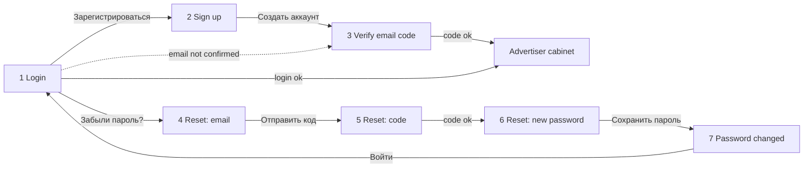

# Advertiser authentication — screens, states and Supabase Auth mapping

Code: [`../react/src/auth/`](../react/src/auth/) — one component per screen, presentational (props in, callbacks out). Live: [`../reference/screens.html`](../reference/screens.html) (`?screen=…&theme=light|dark&lang=ru|kk|en&variant=…`). Static HTML of every screen and state: [`../html/auth/`](../html/auth/) (`light/`, `dark/`, `states/`). Screenshots: [`../screenshots/auth/`](../screenshots/auth/) (`desktop-light`, `desktop-dark`, `states`, `mobile`). Copy keys: [`../react/src/i18n/auth.ru.json`](../react/src/i18n/auth.ru.json) (+ `kk`, `en`, same keys).

## Flow



## Shared layout (all 7 screens)

Two columns on desktop (≥ 761px), one column on phones.

- **Left: brand panel** — flex 1 1 520, margin 16, radius `radius-2xl` 28, padding 48, bg `brand-panel`. Dark theme adds 1px `border`. Content top-to-bottom with space-between: Logo (white variant in light, colour in dark, mark 28px) → pitch (`common.tagline` Geologica 600 44/1.12 in `on-brand-panel`, `common.taglineSub` 17/1.55 in `on-brand-panel-muted`, max width 520) → `common.copyright` 13px `on-brand-panel-muted`. Decorative big mark in the top-right corner, 66% of the panel width, cropped (right −12%, top −6%): white mark at 16% opacity in light, colour mark at 100% in dark.
- **Right: form column** — flex 1 1 480, padding 24 × 72. Top bar: optional ghost «Назад» button (left) + SegmentedControl «Қаз · Рус · Eng» and ThemeToggle (right). Body: form centered vertically and horizontally, max width 420, children 24 apart. Footer (right-aligned): «Политика конфиденциальности», «Оферта» 13px `text-subtle`.
- **Head of each form**: optional 56×56 icon tile (radius 16, `primary-soft` bg + `link` icon; success screen uses `success-soft` + `success`), optional neutral Badge «Шаг n из 3», title `h1` (38, 30 on phone), subtitle 16/1.5 `text-muted` (emails in it are `text` 600).
- **Phone (≤ 760px)**: the brand panel becomes a compact header (margin 12 12 0, padding 20, radius 16, tagline 22px, sub-text, © and the decorative mark hidden); form column padding 16 × 20; form aligned to the top.

## React components and routes

| # | Component | Default path (`DEFAULT_AUTH_LINKS`) | Main props |
|---|---|---|---|
| 1 | `LoginScreen` | `/login` | `loading`, `error: 'invalid' \| 'unconfirmed' \| 'ratelimit'`, `email` (for the «unconfirmed» text), `onSubmit({ email, password })` |
| 2 | `SignupScreen` | `/signup` | `loading`, `emailTaken`, `passwordRejected`, `onSubmit({ email, password })` — client validation and the consent checkbox are inside |
| 3 | `VerifyEmailScreen` | `/signup/verify` | `email`, `loading`, `error: 'invalid' \| 'expired'`, `resendSeconds` (60), `resendAvailable`, `onSubmit(code)`, `onResend()` |
| 4 | `ResetPasswordEmailScreen` | `/reset-password` | `loading`, `defaultEmail`, `onSubmit(email)` |
| 5 | `ResetPasswordCodeScreen` | `/reset-password/code` | same as 3 |
| 6 | `ResetPasswordNewScreen` | `/reset-password/new` | `loading`, `rejected` (server `weak_password`), `onSubmit(password)` |
| 7 | `ResetPasswordDoneScreen` | `/reset-password/done` | — |

All screens render inside `AuthLayout` and take links from `AuthLinksProvider` (also `home`, `privacy`, `offer`). Validation: `validation.ts` (`validateEmail`, `validateNewPassword`). Supabase calls: `supabaseAuth.ts` — each function takes your `SupabaseClient` and returns `{ ok: true }` or `{ ok: false, error }` where `error` is already the screen state (`'invalid'`, `'unconfirmed'`, `'ratelimit'`, `'expired'`, `'weak'`, `'unknown'`).

```tsx
// /login — wiring example (React Router)
const [state, setState] = useState<{ loading: boolean; error: LoginError | null; email?: string }>({ loading: false, error: null });
<LoginScreen
  {...state}
  onSubmit={async ({ email, password }) => {
    setState({ loading: true, error: null });
    const r = await supabaseAuth.signIn(supabase, email, password);
    if (r.ok) return navigate('/app');
    if (r.error === 'unconfirmed') { await supabaseAuth.resendSignupCode(supabase, email); return navigate('/signup/verify', { state: { email } }); }
    if (r.error === 'unknown') { setState({ loading: false, error: null }); return showNetworkError(); } // design gap, see below
    setState({ loading: false, error: r.error, email });
  }}
/>
```

## Screens

| # | Screen | Elements (in order) | Primary action → next | Copy keys |
|---|---|---|---|---|
| 1 | Login | title, subtitle, [form Alert], Email, Password + «Забыли пароль?», Button «Войти», «Нет аккаунта? Зарегистрироваться» | sign in → cabinet | `login.*` |
| 2 | Sign up | title, subtitle, Email, Password (hint), Checkbox consent with links to offer and privacy policy, Button «Создать аккаунт», «Уже есть аккаунт? Войти» | sign up → 3 | `signup.*` |
| 3 | Verify email | back → 2, mail icon tile, title, subtitle with email, OtpInput, Button «Подтвердить», resend timer/link, «Не та почта? Изменить» → 2 | verify → cabinet | `verify.*` |
| 4 | Reset: email | back «Ко входу» → 1, Badge «Шаг 1 из 3», title, subtitle, Email, Button «Отправить код», «Вспомнили пароль? Войти» | send code → 5 | `reset.email.*` |
| 5 | Reset: code | back → 4, Badge «Шаг 2 из 3», title, subtitle with email, OtpInput, Button «Продолжить», resend timer/link, «Не та почта? Изменить» → 4 | verify → 6 | `reset.code.*` |
| 6 | Reset: new password | Badge «Шаг 3 из 3», title, subtitle, Password (new-password, hint), Button «Сохранить пароль» | update → 7 | `reset.newPassword.*` |
| 7 | Password changed | success icon tile, title, subtitle, Button «Войти» → 1 | — | `reset.done.*` |

Common strings (labels, placeholders, show/hide password, language and theme labels, resend texts, step badge): `common.*`.

## States to implement (all exist in the reference — `variant` param; static copies in `html/auth/states/`)

| Screen | State | UI |
|---|---|---|
| Login | `error` — wrong email or password | danger Alert `login.errors.invalidTitle` + `invalidBody`; fields keep values |
| Login | `unconfirmed` — email not confirmed | info Alert `unconfirmedTitle/Body`; resend the signup code and route to screen 3 |
| Login | `ratelimit` — too many attempts | warning Alert `rateLimitTitle/Body`; submit disabled until the window passes |
| Login | `loading` | primary button loading, form blocked |
| Sign up | `errors` | field errors: `signup.errors.emailTaken`, `passwordShort` / `passwordWeak`, `terms` |
| Verify / Reset code | `error` | OtpInput error `verify.errors.invalid`; resend link available |
| Verify / Reset code | `expired` | OtpInput error `verify.errors.expired`; a new code is sent automatically |
| Any form | client validation | empty → `login.errors.required`; bad email → `login.errors.emailFormat` (on blur / submit) |

## Supabase Auth mapping (supabase-js v2; implemented in `react/src/auth/supabaseAuth.ts`)

Email delivery: SMTP via **Resend** on the `apexmedia.kz` domain. Email templates must show the **6-digit code** `{{ .Token }}`, not a magic link — edit the «Confirm signup» and «Reset password» templates (self-hosted: GoTrue mailer template env vars).

| Step | Call | Notes |
|---|---|---|
| Sign up (2) | `auth.signUp({ email, password })` | Email confirmation must be ON. With confirmation on, Supabase does **not** return an error for an already registered email (anti-enumeration): a returned user with an empty `identities` array means «already registered» → show `signup.errors.emailTaken` (or treat it as success, product decision). Password rules (min 8, letters + digits) configured in Auth settings and validated on the client too. |
| Verify email (3) | `auth.verifyOtp({ email, token, type: 'email' })` | Success returns a session → go to the cabinet. `signup` type is deprecated in favour of `email`. |
| Resend (3) | `auth.resend({ type: 'signup', email })` | 60-second cooldown in the UI (matches the default per-user email rate limit). |
| Sign in (1) | `auth.signInWithPassword({ email, password })` | Map error `code`: `invalid_credentials` → `invalid*`; `email_not_confirmed` → `unconfirmed*` (+ `resend` and go to 3); `over_request_rate_limit` / HTTP 429 → `rateLimit*`. |
| Reset: email (4) | `auth.resetPasswordForEmail(email)` | Always go to step 5 with the same neutral text (do not reveal whether the account exists). |
| Reset: code (5) | `auth.verifyOtp({ email, token, type: 'recovery' })` | Returns a session. Errors `otp_expired` / invalid → OtpInput error. |
| New password (6) | `auth.updateUser({ password })` | Then show screen 7. `weak_password` → field error. |
| Done (7) | — | «Войти» goes to Login. (The user already has a session after step 5; the product may go straight to the cabinet instead — product decision.) |

Error `code` names can differ between GoTrue versions — check them against the deployed (self-hosted) Supabase version and keep the mapping in one place.

## After sign-in

Company name and БИН are **not** asked at sign-up — they are collected in onboarding after the first login (screens not designed yet).

## Design gaps (not designed yet — flag, do not invent)

- Network / unknown server error (`error: 'unknown'` from `supabaseAuth.ts`): no state and no copy yet. Until designed, show a `danger` Alert above the form with a generic «try again» text and list it in «Design gaps».
- Onboarding after the first sign-in (company name, БИН) and the cabinet itself.
