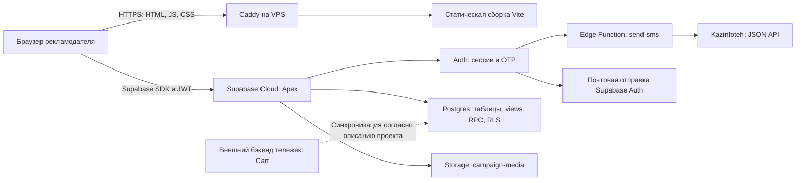
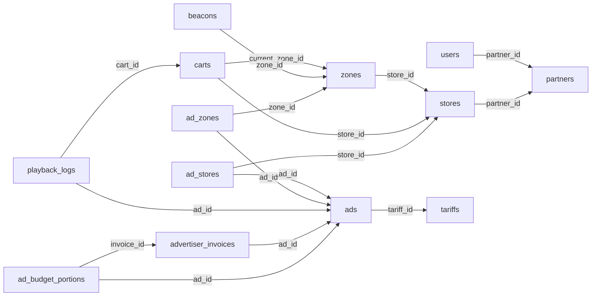

# Apexmedia — техническое описание проекта

**Снимок состояния: 7 октября 2026 года, `main`, коммит `ae03ddd`.**

Документ для разработчика, который впервые открывает проект. Описание фронтенда сверено с исходниками и `package-lock.json`; инфраструктура — с выполненным 7 октября деплоем. Структура БД зафиксирована по сгенерированному `database.types.ts`: это контракт API, а не полный SQL-дамп или аудит текущих прав доступа.

## Содержание

1. [Назначение и архитектура](#1-назначение-и-архитектура)
2. [Стек и локальный запуск](#2-стек-и-локальный-запуск)
3. [Структура исходников и маршруты](#3-структура-исходников-и-маршруты)
4. [Авторизация, регистрация и профиль](#4-авторизация-регистрация-и-профиль)
5. [Кампании, тарифы и медиа](#5-кампании-тарифы-и-медиа)
6. [Статистика и аналитика магазинов](#6-статистика-и-аналитика-магазинов)
7. [База данных и API](#7-база-данных-и-api)
8. [Инфраструктура](#8-инфраструктура)
9. [Правила разработки и незавершённые части](#9-правила-разработки-и-незавершённые-части)

Приложения:

- [Справочник БД: таблицы, поля, связи, views и RPC](DATABASE_SCHEMA.md).
- [Сервер, Caddy, деплой и откат](DEPLOYMENT.md).

## 1. Назначение и архитектура

Apexmedia — платформа размещения рекламы на экранах покупательских тележек в супермаркетах Казахстана. Рекламодатель выбирает магазины и, для соответствующих тарифов, зоны у полок, загружает ролик, задаёт бюджет и отправляет кампанию на модерацию. Далее он следит за состоянием кампаний, расходом бюджета и показами.

Этот репозиторий содержит публичный сайт и **кабинет рекламодателя**. Название репозитория `apex-admin` не означает, что здесь реализованы все экраны администраторов, модераторов и партнёров. Проигрыватель на тележках и обработка событий оборудования находятся вне этого фронтенда.

| Ресурс | Адрес / назначение |
| --- | --- |
| Репозиторий | [Bekaa1/apex-admin](https://github.com/Bekaa1/apex-admin) |
| Рабочий сайт | [https://apexmedia.kz](https://apexmedia.kz) |
| VPS фронтенда | `31.130.153.154` |
| Рабочий Supabase Cloud | `https://eveylcsziemhqouazebu.supabase.co`, проект **Apex** |
| Панель проекта | [Supabase Dashboard](https://supabase.com/dashboard/project/eveylcsziemhqouazebu) |
| Версия размещённого фронтенда | [version.json](https://apexmedia.kz/version.json) |



Фронтенд — SPA. В репозитории нет отдельного Node/Express API-сервера: запросы идут из браузера прямо в Supabase. `api.ts` внутри раздела — модуль клиентских запросов, а не отдельный сервер.

В существующем описании проекта ([CLAUDE.md](../CLAUDE.md)) указан отдельный Cloud-проект **Cart** (`yasoadhyjmstegjhcdzi`) и синхронизация Cart → Apex раз в час. В этом репозитории нет полного кода этой синхронизации; её расписание и фактическое выполнение следует проверять у владельца бэкенда. Минутный опрос из браузера не делает такие данные потоковыми.

## 2. Стек и локальный запуск

Версии ниже взяты из `package-lock.json`; диапазоны в `package.json` могут отличаться.

| Слой | Технология / версия |
| --- | --- |
| UI | React / React DOM 19.3.0 |
| Типизация | TypeScript 6.0.3 |
| Сборка и dev-сервер | Vite 8.3.2, `@vitejs/plugin-react` |
| Маршруты | `react-router` 7.18.4, вложенные и ленивые маршруты |
| Серверные данные в UI | `@tanstack/react-query` 5.104.1 |
| Клиент бэкенда | `@supabase/supabase-js` 2.117.2 |
| Линтер | Oxlint 1.87.0 |
| Стили | Собственная дизайн-система, CSS tokens, CSS Modules; также существующие CSS-области `auth`, `cab`, `cmp` |
| Шрифты | Локальные Geologica и Onest |
| Локализация | JSON-словари `ru`, `kk`, `en`, собственный I18nProvider |
| Серверные сервисы | Supabase Auth, PostgreSQL/PostgREST, Storage, Edge Functions на Deno |
| Раздача production | Caddy в Docker, статические файлы `dist/` |

Нужны Node.js 20.19+ или 22.12+ и npm. При последнем деплое использовался Node.js 22.23.2.

```powershell
git clone https://github.com/Bekaa1/apex-admin.git
cd apex-admin
npm ci
Copy-Item .env.example .env.local
# Заполнить .env.local значениями нужного окружения.
npm run dev
```

По умолчанию приложение открывается на `http://localhost:5173`. `index.html` в корне — обязательная точка входа Vite.

```dotenv
VITE_SUPABASE_URL=https://eveylcsziemhqouazebu.supabase.co
VITE_SUPABASE_ANON_KEY=<public-anon-or-publishable-key>
```

Значения получают у владельца проекта. `VITE_*` встраиваются в браузерную сборку: здесь допустим только публичный ключ, **не `service_role`, пароль БД или ключ SMS-провайдера**. Защита данных обеспечивается серверными правами и RLS. `.env.local` исключён из Git, образец — [.env.example](../.env.example).

После изменения env перезапустить dev-сервер; для production нужна новая сборка. По умолчанию локальный фронтенд с приведённым URL работает с рабочим Cloud-проектом: отправка OTP, создание аккаунтов и кампаний будут настоящими. Отдельное staging-окружение в репозитории не описано.

| Команда | Действие |
| --- | --- |
| `npm run dev` | Vite dev-сервер |
| `npm run lint` | Oxlint |
| `npm run build` | `tsc -b` и production-сборка в `dist/` |
| `npm run preview` | Локальный просмотр сборки |

## 3. Структура исходников и маршруты

```text
src/
  main.tsx                    провайдеры приложения
  App.tsx, routes.tsx          RouterProvider и дерево маршрутов
  design-system/              компоненты, tokens, темы
  assets/fonts/               локальные шрифты
  i18n/                       словари разделов ru/kk/en
  landing/                    публичная главная
  legal/                      политика и оферта, JSON текстов и рендерер
  auth/                       вход, OTP, регистрация, восстановление, RequireSession
  cabinet/
    CabinetLayout.tsx         общий каркас кабинета
    sections.ts               меню, маршруты и подписи разделов
    api.ts, useAccount.ts      данные аккаунта для каркаса
    campaignStatus.ts         статусы и оформление кампаний
    tariffs.ts                тарифы и минимальные бюджеты в UI
    home/                     главная кабинета
    campaigns/                API и список кампаний
      list/                   компоненты списка
      wizard/                 создание, копирование, исправление кампании
      corporate/              корпоративная заявка
    analytics/                каталог магазинов и показатели площадок
    profile/                  личные данные и смена контактов
  lib/
    supabase.ts               единственный клиент Supabase
    database.types.ts         сгенерированный контракт public schema
    queryClient.ts            настройки кэша
    dates.ts, format.ts        даты и форматирование
supabase/
  functions/send-sms/         код SMS hook
  migrations/                сохранённая миграция профиля; история БД неполная
public/legal/                оригиналы юридических документов DOCX
apex-design-kit/             исходный дизайн-кит, справочный материал
```

Провайдеры: React Query → тема → i18n → AuthSessionProvider → приложение. React StrictMode включён. Данные обычно проходят цепочку **компонент → хук раздела → `api.ts` → Supabase**.

React Query по умолчанию: `staleTime = 60 секунд`, одна повторная попытка, без обновления при фокусе окна. Ключи пользовательских запросов включают `userId`; при смене аккаунта кэш очищается. Аналитика отдельно обновляется каждую минуту и при возврате фокуса.

### Маршруты

| Путь | Состояние / назначение |
| --- | --- |
| `/` | Лендинг |
| `/login` | Вход по email/телефону и паролю, сценарии OTP |
| `/signup` | Email, телефон, пароль; после email — подтверждение телефона |
| `/signup/verify` | Проверка OTP |
| `/signup/profile` | ФИО, БИН, компания |
| `/reset-password` и `/code`, `/new`, `/done` внутри него | Восстановление доступа |
| `/privacy`, `/offer` | Юридические документы |
| `/cabinet` | Главная: сводка и кампании |
| `/cabinet/campaigns` | Список кампаний |
| `/cabinet/campaigns/new` | Создание; `?copy=<id>` — повторить кампанию |
| `/cabinet/campaigns/corporate` | Корпоративная заявка |
| `/cabinet/campaigns/:campaignId/fix` | Исправление отклонённой кампании |
| `/cabinet/campaigns/:campaignId/sent` | Результат отправки |
| `/cabinet/campaigns/:campaignId` | Маршрут зарегистрирован, страница пока заглушка |
| `/cabinet/stats` | Отдельный раздел статистики пока заглушка |
| `/cabinet/analytics` | Поиск, фильтры и сортировка магазинов |
| `/cabinet/analytics/stores/:storeId` | Показатели выбранного магазина |
| `/cabinet/profile` | Редактирование профиля и контактов |

`sections.ts` создаёт одновременно пункты меню и маршруты; новый раздел регистрируется в нём. `/cabinet/*` обёрнут в `RequireSession`. Веб-сервер должен возвращать `index.html` для вложенных SPA-адресов, иначе обновление страницы даст 404.

Есть светлая/тёмная темы и ru/kk/en. Тексты политики и оферты сейчас хранятся на русском; смена языка интерфейса не переводит тело документов. Dev-сценарии `?demo=...` главной/списка работают только в development после входа.

## 4. Авторизация, регистрация и профиль

### Две разные сущности пользователя

- **Supabase Auth (`auth.users`)** — идентификатор пользователя, контактные данные входа, подтверждения, пароль, сессии. Управлять ими через Auth API.
- **`public.users`** — профиль и бизнес-поля: `full_name`, `bin`, `company_name`, роли, баланс, партнёрские параметры. Код использует `public.users.id = auth.uid()`.

Не менять email/phone входа обычным `UPDATE public.users`: это не заменяет подтверждение контакта в Auth. Исходник триггера первоначального создания профиля и полной синхронизации контактов в текущую папку миграций не включён.

### Регистрация нового рекламодателя

1. Пользователь вводит **email и телефон**, пароль, принимает оферту/политику.
2. `auth.signUp({ email, password, options: { data: ... } })` создаёт аккаунт с меткой `signup_flow: 'email_phone_v1'` и черновиком `signup_phone`.
3. Email подтверждается шестизначным OTP (`verifyOtp`, тип `email`). Повторная отправка — тип `signup`.
4. В той же сессии `auth.updateUser({ phone, data: ... })` отправляет код на телефон. Проверка — `verifyOtp` с типом `phone_change`. Второй аккаунт для номера не создаётся.
5. Фронтенд проверяет тот же `user.id`, подтверждённые email/phone и соответствие номера. Затем открывается форма ФИО, БИН и компании.
6. RPC `complete_signup_profile(p_full_name, p_bin, p_company_name)` сохраняет поля в собственном `public.users`; после успеха — `/cabinet`.

Email нормализуется при регистрации (`trim`, lowercase). Телефон приводится к `+77XXXXXXXXX`: поддерживается локальный ввод десяти цифр и одиннадцать цифр с начальной `7` или `8`. Валидация находится в [auth/validation.ts](../src/auth/validation.ts). Пароль: минимум 8 символов, буквы и цифры.

Занятость контакта определяется ответами Auth. Для подтверждённого существующего email дополнительно обработан успешный ответ с пустым `identities`; для номера — `phone_exists` при привязке. Отдельного клиентского чтения всех пользователей или обязательного предварительного запроса `check_phone_exists` в текущем signup нет.

Метка `signup_flow` управляет UI и хранится в изменяемом `user_metadata`; она **не является серверным признаком прав**. Требование двух контактов реализовано в сценарии и guard фронтенда. Для старых аккаунтов без метки сохраняется прежний вход. Серверное принудительное ограничение всех бизнес-операций до завершения такого onboarding этой правкой не добавлено. Guard кабинета также не проверяет заполнение всех полей компании.

### Сессии и восстановление

Единственный клиент — [lib/supabase.ts](../src/lib/supabase.ts): `persistSession`, `autoRefreshToken`, `detectSessionInUrl` включены. [AuthSessionProvider](../src/auth/AuthSessionProvider.tsx) обрабатывает события Auth и смену аккаунта. Выход завершает локальную сессию; разделы не должны самостоятельно создавать второй клиент.

Восстановление email использует `resetPasswordForEmail`, OTP `recovery` и `updateUser({ password })`. Телефонный сценарий использует SMS OTP существующего пользователя (`shouldCreateUser: false`). UI-редирект сам по себе не заменяет RLS.

### Профиль

[profile/api.ts](../src/cabinet/profile/api.ts) читает `full_name`, `bin`, `company_name` по собственному ID. В UI редактируются ФИО и название компании; существующий БИН передаётся при сохранении без изменения через тот же `complete_signup_profile`.

Смена контакта — `auth.updateUser` → OTP → `verifyOtp`. Email-форма предусматривает коды на текущую и новую почту; телефонная — код на новый номер. Повторный код изменения запрашивается повторным `updateUser`. Ошибки `email_exists` и `phone_exists` имеют отдельные сообщения.

При диагностике email-change учитывать текущую реализацию: первый вызов `verifyOtp(type: 'email_change')` получает `currentEmail`, второй — новый адрес. Совместимость этого сценария с настройкой Secure email change нужно проверять вместе с Auth-конфигурацией; документ не подтверждает повторное прохождение этого сценария в production.

### SMS и email

Код SMS hook — [supabase/functions/send-sms](../supabase/functions/send-sms). Auth вызывает Edge Function, она проверяет подпись Standard Webhooks, берёт целевой номер из `event.sms.phone` (резервно — `user.phone`) и делает JSON-запрос `POST /api/sms/send` в Kazinfoteh. Номер передаётся без `+`, запрос содержит `from`, `to`, `text`, `extra_id`; Basic Auth формируется на сервере.

Серверные переменные: `SEND_SMS_HOOK_SECRET`, `KAZINFOTEH_LOGIN`, `KAZINFOTEH_PASSWORD`, необязательная `KAZINFOTEH_API_BASE_URL` (по умолчанию `https://so.kazinfoteh.org`). В hook есть таймаут, ограничения payload и проверка ответа провайдера. Принятие сообщения провайдером ещё не доказывает доставку абоненту.

| Префиксы после кода страны | Поведение текущего `routing.ts` |
| --- | --- |
| 701, 702, 775, 778 | Sender `KiT_Notify` |
| 700, 707, 708, 747 | Sender `InfoSMS` |
| 705, 706, 771, 776, 777 | Отказ `APEX_SMS_BEELINE_DISABLED` |
| Остальные | Отказ `APEX_SMS_PREFIX_UNSUPPORTED` |

Маршрутизация основана на префиксе, без проверки переноса номера между операторами. **Из-за обязательного телефона эти ограничения влияют на возможность закончить регистрацию.** Полный охват номеров нельзя считать готовым.

Email отправляет Supabase Auth; шаблоны и настройки доставки находятся в Dashboard, а не в этом репозитории. Автоматического выбора языка письма по языку UI сейчас нет; SMS-текст в hook русский.

## 5. Кампании, тарифы и медиа

### Сценарий

Мастер собирает описание и медиа, тариф, магазины, зоны (если тариф позволяет), бюджет и согласие с правилами. Каталог поступает из RPC `catalog_stores` и `catalog_zones`. Отправка выполняется через `submit_campaign({ p })`, исправление — через `resubmit_campaign({ p_id, p })`.

Основной JSON-контракт `p` в [campaigns/api.ts](../src/cabinet/campaigns/api.ts):

```typescript
{
  name: string;
  description: string;
  tariff_code: 'standard' | 'zones' | 'premium';
  video: { url: string; file_name: string; duration_sec: number;
           width: number; height: number; size_bytes: number };
  cover: { url: string; file_name: string } | null;
  store_ids: string[];
  zone_ids: string[];
  budget: number;
  request_id: string;
}
```

`request_id` используется для повторной отправки одного запроса без создания дублей. Черновик мастера и идентификатор запроса сохраняются в `sessionStorage` с привязкой к пользователю/источнику. Сохраняются метаданные загруженных файлов, а не объекты `File`.

При копировании/исправлении загружается собственная строка `ads` с `user_id`, связи `ad_stores`, `ad_zones` и тариф. Неподходящие старые URL или отсутствующие метаданные требуют повторной загрузки. В режиме исправления бюджет и тариф заблокированы.

Корпоративная форма вызывает `submit_corporate_request({ p: { company, contact_name, phone, message } })`. Это самостоятельная заявка; дальнейшая обработка менеджером находится за пределами данного UI.

### Тарифы в текущем UI

| Код | Минимальный бюджет, ₸ | Особенности |
| --- | ---: | --- |
| `standard` | 500 000 | Магазины, без выбора зон |
| `zones` | 1 000 000 | Добавляется выбор зон |
| `premium` | 2 000 000 | Зоны и звук |
| Корпоративный | По договорённости | Отдельная заявка |

Это минимальные бюджеты кампании из [tariffs.ts](../src/cabinet/tariffs.ts), а не цена одного показа. В БД есть `tariffs.price_per_play`, `version`, `min_amount`, `purchasable`, `is_archived`. RPC повторно проверяют параметры; изменение цен требует согласования серверных тарифов, UI и юридических текстов.

### Загрузка

- Bucket: **`campaign-media`**; путь объекта: `<auth.uid()>/<UUID>.<ext>`.
- Видео: MP4/MOV, до 50 MiB, 7 секунд с допуском ±0,3, минимум 1280×720, горизонтальное 16:9 с допуском 2%.
- Обложка: JPEG/PNG; возможно извлечение кадра из видео.
- Браузер проверяет метаданные, загрузка через XMLHttpRequest поддерживает прогресс/отмену и использует текущий JWT. В кампанию сохраняются URL и исходное имя отдельно.
- Фронтенд использует публичные URL Storage. Права загрузки/изменения объектов должны ограничиваться серверными Storage policies.

### Модерация и оплата

В контракте есть статусы `pending`, `awaiting_payment`, `active`, `rejected`, `draft`, `archived`, `deleted`, `paused`, `hours_ended`, `budget_ended`, `completed`. UI интерпретирует их через [campaignStatus.ts](../src/cabinet/campaignStatus.ts); допустимые переходы определяет бэкенд.

Список показывает `paid_amount`, `unpaid_amount`, `invoice_sent_to`, причины отклонения и комментарий модератора из `my_campaigns_stats`. Бэкенд содержит `advertiser_invoices`, `ad_budget_portions` и административные RPC оплаты/модерации. Полного платёжного checkout и административных экранов в этом репозитории нет. Наличие `sent_to` или текста «счёт отправлен» в UI не является подтверждением фактической отправки письма; при подключении кампаний доставку счетов отмечали как незавершённую интеграцию.

## 6. Статистика и аналитика магазинов

Раздел **«Аналитика»** помогает выбрать площадку: показывает общее состояние магазина и показы всей рекламы в нём. Он отличается от персональной статистики собственных кампаний.

| Экран | Источники |
| --- | --- |
| Каркас кабинета | Собственный `users.company_name` |
| Главная | `my_campaigns_stats`, `my_daily_plays_by_campaign` за 14 дней, собственные `ads`, справочник `stores` |
| Список кампаний | `my_campaigns_stats`, `my_daily_plays_by_campaign` за 30 дней |
| Каталог аналитики | `stores`, `store_cart_connectivity`, `store_stats`, `store_daily_stats` |
| Магазин в аналитике | Те же агрегаты, `zones` по `store_id` |
| Профиль | Собственный `users` и текущий Auth user |

Списки читаются страницами по 1000 строк с `count: 'exact'`, чтобы лимит PostgREST не обрезал данные незаметно. Аналитика пока загружает общий доступный каталог и историю, затем фильтрует на клиенте. При росте объёма данных потребуется серверная фильтрация/агрегация.

Фильтры аналитики хранятся в URL: `q`, `city`, `sort`, `period`, `from`, `to`. Период по умолчанию — сегодня. Важные особенности текущих расчётов:

- Для аналитики используется UTC-дата; на главной и в списке кампаний — `Asia/Almaty` через `todayInAlmaty`.
- `7d` включает предыдущие 7 дней и текущий; `30d` — предыдущие 30 и текущий. Это фактически диапазоны 8 и 31 календарного дня.
- Сегодня/неделя/месяц берут итог из `store_stats`. Произвольный диапазон суммирует `store_daily_stats` и ограничен доступной историей.
- В произвольном допустимом диапазоне отсутствующие даты сейчас заполняются нулём. В обычных периодах среднее считается по имеющимся дневным строкам. Текущий незавершённый день исключается из среднего. Это разные правила; не предполагать автоматически одинаковую семантику.
- Дневная история и сводные показатели могут расходиться из-за разных источников/сроков хранения. Недоступное значение не следует интерпретировать как доказанный ноль.

Источник числа тележек онлайн — **`store_cart_connectivity.online_carts`**, основанный на сохранённых статусах `carts`. `active` и `online` — разные значения enum. Фронтенд не определяет соединение по heartbeat, не подписан на Realtime и не использует `last_ping_at`/`last_seen_at` для пересчёта онлайн.

Кнопка выбора площадки в аналитике пока открывает `CampaignPreview` — информационный диалог. Передача выбранного магазина в мастер кампании ещё не подключена.

## 7. База данных и API

В снимке `public`: **33 таблицы, 39 views, 250 функций, 2 enum**. Значительная часть функций относится к PostGIS. Полные поля таблиц/views и контракты прикладных RPC приведены в [DATABASE_SCHEMA.md](DATABASE_SCHEMA.md).

### Основные группы

| Группа | Объекты |
| --- | --- |
| Пользователь и партнёр | `users`, `partners`, `user_store_access` |
| Площадки и оборудование | `stores`, `zones`, `carts`, `beacons` |
| Рекламная кампания | `ads`, `ad_stores`, `ad_zones`, `tariffs` |
| Финансы рекламодателя | `advertiser_invoices`, `ad_budget_portions` |
| Другие финансовые объекты | `invoices`, `payments`, `partner_revenue`, `partner_payouts` |
| Показ и агрегаты | `playback_logs`, `ad_view_history`, `cartplayer_playback_sessions`, `store_daily_stats` |
| Заявки и коммуникации | `corporate_requests`, `notifications`, `creative_comments`, `support_tickets` |
| Прочее | `documents`, `reports`, `audit_log`, `auctions`, `auction_bids`, `filtr` |
| Технические объекты | `ads_backup_20261006`, `spatial_ref_sys` |

Не смешивать `advertiser_invoices` со второй таблицей `invoices`: в типах у них разные поля и связи; `payments.invoice_id` связан именно с `invoices`. Не подключать новый экран оплаты по одному лишь сходству названий.

### Основные связи

На диаграмме показаны связи с таблицами, присутствующие в сгенерированном контракте. Nullable FK могут быть пустыми; это укрупнённая схема, точные ограничения — в БД.



Дополнительно код логически связывает `ads.user_id` с пользователем Auth и `public.users.id` с `auth.uid()`. Отсутствие межсхемной связи в generated types не доказывает отсутствие SQL FK. Старые одиночные `ads.store_id`/`zone_id` сосуществуют с таблицами множественного выбора `ad_stores`/`ad_zones`; для мастера нужно учитывать последние.

### Как обращаться к данным

- Персональную статистику рекламодателя читать через `my_*` views. Глобальные `all_*`, `advertiser_*`, `partner_*` не являются взаимозаменяемыми источниками его данных.
- Обычные чтения SDK идут через `/rest/v1/<table-or-view>`, RPC — `/rest/v1/rpc/<function>`, Auth — `/auth/v1`, Storage — `/storage/v1` на домене Cloud-проекта. Для этих сценариев отдельный backend-сервер не требуется.
- Профиль сохранять через `complete_signup_profile`, кампанию — через специализированные RPC. Не переносить проверку владельца, начисления и модерацию в браузер.
- Для прямого чтения `ads` фронтенд добавляет `.eq('user_id', userId)`. В предыдущем описании системы отмечалась широкая видимость `ads`; текущие grants/RLS после серверных изменений требуют отдельной проверки. Клиентский фильтр не является защитой.
- Имена `my_*` и `admin_*`, наличие функции в типах сами по себе не доказывают её права доступа. Проверять определения views/functions, grants, `SECURITY DEFINER`, `search_path` и политики в нужном проекте.

### Типы и миграции

[database.types.ts](../src/lib/database.types.ts) генерируется из проекта **Apex**, вручную его не править. Типы описывают сериализацию API: `string` не позволяет отличить UUID от SQL text/timestamp, а `unknown` может обозначать геометрию или другой неподдержанный генератором тип.

В Git есть [миграция профиля](../supabase/migrations/20261006000000_secure_signup_profile.sql): собственный SELECT для `users`, отзыв прямых записей, `SECURITY DEFINER complete_signup_profile` с `auth.uid()` и пустым `search_path`. Это изменение существующей БД; миграция ожидает четыре старые политики, поэтому её нельзя считать универсальным скриптом создания/повторного восстановления проекта.

**Полной истории SQL-миграций, RLS, триггеров, views и функций кампаний здесь нет.** Для нового окружения нужны актуальные серверные миграции/дамп схемы от владельца БД, настройки Auth, Storage, Edge Functions и синхронизации. Одного клонирования Git недостаточно для восстановления всего бэкенда.

## 8. Инфраструктура

Production-фронтенд размещён на VPS `31.130.153.154`, SSH `root`, порт 22. При проверке сервер сообщил Ubuntu 26.04.1 LTS, hostname `9220183-lm697753.twc1.net`. Название провайдера и доступ к его панели в репозитории не зафиксированы; получить у владельца.

Трафик принимает **Caddy 2.11.4 в контейнере `supabase-caddy`**, не Nginx. TLS для `apexmedia.kz` выдан автоматически через Let’s Encrypt. Файлы сайта находятся в релизах с переключаемой ссылкой `current`.

На VPS также запущены отдельный self-hosted Supabase (`supabase.apexmedia.kz`), n8n и сервисы бота. **Рабочая сборка React подключена к Cloud `eveylcsziemhqouazebu.supabase.co`, не к этому self-hosted Supabase.** Назначение и синхронизация двух установок требуют уточнения перед любым переносом.

Деплой ручной: локальная сборка → архив → SFTP → новый каталог релиза → переключение `current`. Автоматического деплоя при push в main в репозитории нет. Подробные пути, конфигурация, проверка и откат — [DEPLOYMENT.md](DEPLOYMENT.md).

## 9. Правила разработки и незавершённые части

### Начало работы

1. Прочитать [AGENTS.md](../AGENTS.md), проверить ветку и рабочее дерево, обновиться от `origin/main`.
2. Получить доступ к GitHub, Cloud-проекту Apex и нужному окружению. Для операций с сервером — SSH; для DNS — панель владельца домена. Доступы передаются отдельно, не в Git.
3. Раздел вести в `src/cabinet/<section>/`, запросы — в `api.ts`, хуки React Query — рядом, переводы — `src/i18n/<section>.*.json`.
4. Общие файлы маршрутизации, layout, токены и зависимости менять согласованно. Сохранять существующие публичные URL и структуру исходного дизайн-кита.
5. Для нового UI предусмотреть ru/kk/en, обе темы, desktop/mobile, loading/empty/error. Использовать компоненты и токены дизайн-системы.
6. Перед передачей изменений выполнить `npm run lint`, `npm run build`; PR в main обычно объединяется через squash. Deploy — отдельная операция.

### Что ещё требует работы или подтверждения

- Отдельная страница `/cabinet/stats` и детальная карточка кампании — заглушки.
- Выбор магазина из аналитики пока не передаётся в мастер.
- Реальная доставка счетов/уведомлений и платёжный сценарий требуют завершения/проверки на бэкенде; поля БД и тексты UI не подтверждают доставку.
- Подготовлен [проект Правил размещения рекламы](ADVERTISING_RULES.md): цена фиксируется на согласованный период индивидуального договора, следующий период согласовывается по актуальным тарифам. Отдельной страницы правил пока нет. Checkbox мастера не передаёт версию документа/факт согласия в `submit_campaign`.
- SMS ограничен поддерживаемыми префиксами; язык email не связан с UI.
- Двойное подтверждение контактов не стало отдельной серверной политикой допуска к операциям. Полнота профиля не проверяется глобальным guard.
- Требуют отдельной сверки RLS/grants, расписание Cart → Apex, срок хранения истории и правила дат/нулей в метриках.
- Полной воспроизводимой конфигурации БД и автоматического CI/CD здесь нет. Политику резервных копий Cloud/VPS и проверку восстановления нужно получить у владельца инфраструктуры.

Этот документ описывает реализацию на указанном коммите. При изменениях Auth, БД, тарифов, маршрутов или хостинга обновлять соответствующий раздел и дату снимка. `session-log.md` читается и дополняется только по прямому указанию пользователя согласно `AGENTS.md`.
